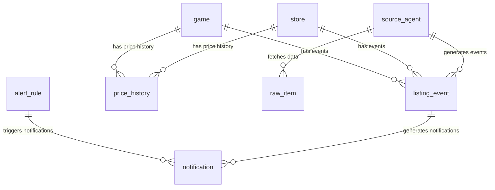

# Модель данных BGW

## Обзор

Система BGW использует реляционную модель данных на PostgreSQL с расширением TimescaleDB для временных рядов. Все сущности следуют принципам нормализации и имеют четкие связи между собой.

## Основные таблицы

### game - Игры

Основная сущность системы - настольные игры.

```sql
CREATE TABLE game (
    id UUID PRIMARY KEY DEFAULT gen_random_uuid(),
    title VARCHAR(500) NOT NULL,
    synonyms VARCHAR(255)[],
    bgg_id VARCHAR(50) UNIQUE,  -- BoardGameGeek ID
    publisher VARCHAR(200),
    tags VARCHAR(255)[],
    description TEXT,
    min_players INTEGER,
    max_players INTEGER,
    min_playtime INTEGER,  -- в минутах
    max_playtime INTEGER,  -- в минутах
    year_published INTEGER,
    language VARCHAR(10) DEFAULT 'RU',
    complexity FLOAT,  -- 1-5
    image_url VARCHAR(500),
    rating_bgg FLOAT,  -- рейтинг BGG
    rating_users FLOAT,  -- пользовательский рейтинг
    weight FLOAT,  -- вес/сложность
    created_at TIMESTAMPTZ DEFAULT now(),
    updated_at TIMESTAMPTZ
);

-- Индексы для производительности
CREATE INDEX ix_game_title ON game(title);
CREATE INDEX ix_game_bgg_id ON game(bgg_id);
CREATE INDEX ix_game_publisher ON game(publisher);
```

**Ключевые поля:**
- `id`: UUID первичный ключ
- `title`: Название игры (обязательное)
- `synonyms`: Массив синонимов для поиска
- `bgg_id`: ID на BoardGameGeek для интеграции
- `publisher`: Издатель игры

### store - Магазины

Информация об интернет-магазинах и источниках данных.

```sql
CREATE TABLE store (
    id VARCHAR(100) PRIMARY KEY,
    name VARCHAR(200) NOT NULL,
    site_url VARCHAR(500),
    region VARCHAR(10) DEFAULT 'RU',
    currency VARCHAR(3) DEFAULT 'RUB',
    description TEXT,
    logo_url VARCHAR(500),
    contact_email VARCHAR(200),
    contact_phone VARCHAR(50),
    address TEXT,
    working_hours TEXT,
    rating FLOAT,
    is_active BOOLEAN DEFAULT true,
    priority INTEGER DEFAULT 100,
    shipping_info TEXT,
    payment_methods TEXT,  -- JSON
    social_links TEXT,  -- JSON
    created_at TIMESTAMPTZ DEFAULT now(),
    updated_at TIMESTAMPTZ
);
```

### source_agent - Агенты источников

Конфигурации агентов парсинга для каждого источника.

```sql
CREATE TABLE source_agent (
    id VARCHAR(255) PRIMARY KEY,
    name VARCHAR(255) NOT NULL,
    type VARCHAR(50) NOT NULL CHECK (type IN ('api','html','headless','telegram_public')),
    schedule JSONB NOT NULL,
    rate_limit JSONB NOT NULL,
    config JSONB NOT NULL,
    enabled BOOLEAN DEFAULT true,
    created_at TIMESTAMPTZ DEFAULT now(),
    updated_at TIMESTAMPTZ
);
```

**Типы агентов:**
- `api`: Работа с REST API
- `html`: Парсинг HTML страниц
- `headless`: Парсинг динамических сайтов (JavaScript)
- `telegram_public`: Мониторинг Telegram каналов

### listing_event - События листингов

Основные события, которые отслеживает система.

```sql
CREATE TYPE event_kind AS ENUM (
    'announce',   -- Анонс
    'preorder',   -- Предзаказ
    'release',    -- Релиз
    'discount',   -- Скидка
    'price'       -- Обновление цены
);

CREATE TABLE listing_event (
    id UUID PRIMARY KEY DEFAULT gen_random_uuid(),
    game_id UUID REFERENCES game(id),
    store_id VARCHAR(100) REFERENCES store(id),
    kind event_kind NOT NULL,
    title VARCHAR(500),
    edition VARCHAR(200),
    price NUMERIC(12,2),
    currency VARCHAR(3) DEFAULT 'RUB',
    discount_pct NUMERIC(5,2),
    in_stock BOOLEAN,
    start_at TIMESTAMPTZ,
    end_at TIMESTAMPTZ,
    url TEXT,
    source_id VARCHAR(255) REFERENCES source_agent(id),
    signature_hash VARCHAR(64) NOT NULL UNIQUE,
    meta JSONB DEFAULT '{}',
    created_at TIMESTAMPTZ DEFAULT now()
);

-- Индексы
CREATE INDEX ix_listing_event_game_id ON listing_event(game_id, created_at DESC);
CREATE INDEX ix_listing_event_store_id ON listing_event(store_id, created_at DESC);
CREATE INDEX ix_listing_event_kind ON listing_event(kind, created_at DESC);
CREATE UNIQUE INDEX ux_listing_event_signature_hash ON listing_event(signature_hash);
```

### price_history - История цен (TimescaleDB)

Временные ряды цен для аналитики и графиков.

```sql
CREATE TABLE price_history (
    game_id UUID REFERENCES game(id),
    store_id VARCHAR(100) REFERENCES store(id),
    observed_at TIMESTAMPTZ NOT NULL,
    price NUMERIC(12,2) NOT NULL,
    currency VARCHAR(3) DEFAULT 'RUB',
    PRIMARY KEY (game_id, store_id, observed_at)
);

-- Преобразование в hypertable (TimescaleDB)
SELECT create_hypertable('price_history', 'observed_at');

-- Индексы для оптимизации запросов
CREATE INDEX ix_price_history_game_observed ON price_history(game_id, observed_at DESC);
CREATE INDEX ix_price_history_store_observed ON price_history(store_id, observed_at DESC);
CREATE INDEX ix_price_history_price ON price_history(price);

-- Политика удержания данных (2 года)
SELECT add_retention_policy('price_history', INTERVAL '2 years');
```

### alert_rule - Правила уведомлений

Конфигурация правил для триггеринга уведомлений.

```sql
CREATE TABLE alert_rule (
    id UUID PRIMARY KEY DEFAULT gen_random_uuid(),
    name VARCHAR(255) NOT NULL,
    logic VARCHAR(10) NOT NULL CHECK (logic IN ('AND','OR')),
    conditions JSONB NOT NULL,
    channels VARCHAR(255)[] NOT NULL,
    cooldown_hours INTEGER DEFAULT 12,
    enabled BOOLEAN DEFAULT true,
    created_at TIMESTAMPTZ DEFAULT now(),
    updated_at TIMESTAMPTZ
);
```

**Пример условия:**
```json
{
  "logic": "OR",
  "conditions": [
    {"field": "game", "op": "in", "value": ["Dune: Imperium"]},
    {"field": "discount_pct", "op": ">=", "value": 20}
  ],
  "channels": ["webpush", "telegram"],
  "cooldown_hours": 12
}
```

### notification - Уведомления

История отправленных уведомлений.

```sql
CREATE TABLE notification (
    id UUID PRIMARY KEY DEFAULT gen_random_uuid(),
    rule_id UUID REFERENCES alert_rule(id),
    event_id UUID REFERENCES listing_event(id),
    status VARCHAR(20) NOT NULL,
    sent_at TIMESTAMPTZ,
    meta JSONB DEFAULT '{}',
    created_at TIMESTAMPTZ DEFAULT now()
);
```

### raw_item - Сырые данные

Хранение сырых HTML/JSON данных для отладки и реплея.

```sql
CREATE TABLE raw_item (
    id UUID PRIMARY KEY DEFAULT gen_random_uuid(),
    source_id VARCHAR(255) REFERENCES source_agent(id),
    url TEXT,
    fetched_at TIMESTAMPTZ NOT NULL,
    hash VARCHAR(64) NOT NULL,
    content_ref TEXT NOT NULL,  -- S3 ключ
    created_at TIMESTAMPTZ DEFAULT now()
);

CREATE INDEX ix_raw_item_source_id ON raw_item(source_id, fetched_at DESC);
CREATE UNIQUE INDEX ux_raw_item_hash ON raw_item(hash);
```

## Связи между таблицами



## Принципы дедупликации

### Signature Hash

Для предотвращения дублирования событий используется хеш на основе:

1. **Нормализованный заголовок**: Очищается от мусорных слов
2. **ID магазина**: Уникальный идентификатор источника
3. **Издание**: Конкретная версия игры
4. **Округленная цена**: До целых рублей
5. **Временной бакет**: 24-часовой период

```python
signature_hash = sha256(
    f"{normalize(title)}|{store_id}|{normalize(edition)}|{round_price}|{date_bucket}"
)
```

### Период хранения дубликатов

- **Активные проверки**: 72 часа (3 дня)
- **Политика очистки**: 2 года для всех данных
- **TimescaleDB**: Автоматическое сжатие и удаление старых данных

## Оптимизация производительности

### Индексы

1. **Первичные ключи**: UUID для всех основных таблиц
2. **Составные индексы**: Для частых запросов с фильтрацией
3. **Временные индексы**: Оптимизированы под временные ряды в TimescaleDB

### Запросы

```sql
-- Оптимальный запрос истории цен для игры
SELECT ph.*, g.title as game_title, s.name as store_name
FROM price_history ph
JOIN game g ON ph.game_id = g.id
JOIN store s ON ph.store_id = s.id
WHERE ph.game_id = $1
  AND ph.observed_at >= NOW() - INTERVAL '30 days'
ORDER BY ph.observed_at DESC;

-- Поиск событий с фильтрами
SELECT le.*, g.title as game_title
FROM listing_event le
LEFT JOIN game g ON le.game_id = g.id
WHERE le.kind = ANY($1)
  AND le.created_at >= NOW() - INTERVAL '7 days'
  AND le.price >= $2
ORDER BY le.created_at DESC
LIMIT 100;
```

## Резервное копирование

### Ежедневные бэкапы

```bash
# PostgreSQL dump
pg_dump -h localhost -U app app > backup_$(date +%Y%m%d).sql

# Сжатие и архивирование
gzip backup_$(date +%Y%m%d).sql
```

### Восстановление

```bash
# Восстановление из бэкапа
gunzip -c backup_20241026.sql.gz | psql -h localhost -U app app

# Проверка целостности
SELECT COUNT(*) FROM game;
SELECT COUNT(*) FROM listing_event;
```

## Мониторинг производительности

### Ключевые метрики

1. **Размер таблиц**: Мониторинг роста данных
2. **Медленные запросы**: Логирование запросов > 1 сек
3. **Индексы**: Использование и эффективность
4. **Дедупликация**: Коэффициент дублирования событий

### Оптимизация

```sql
-- Анализ медленных запросов
SELECT query, mean_time, calls, total_time
FROM pg_stat_statements
WHERE mean_time > 1000
ORDER BY mean_time DESC;

-- Проверка использования индексов
SELECT schemaname, tablename, indexname, idx_scan, idx_tup_read, idx_tup_fetch
FROM pg_stat_user_indexes
ORDER BY idx_scan DESC;
```